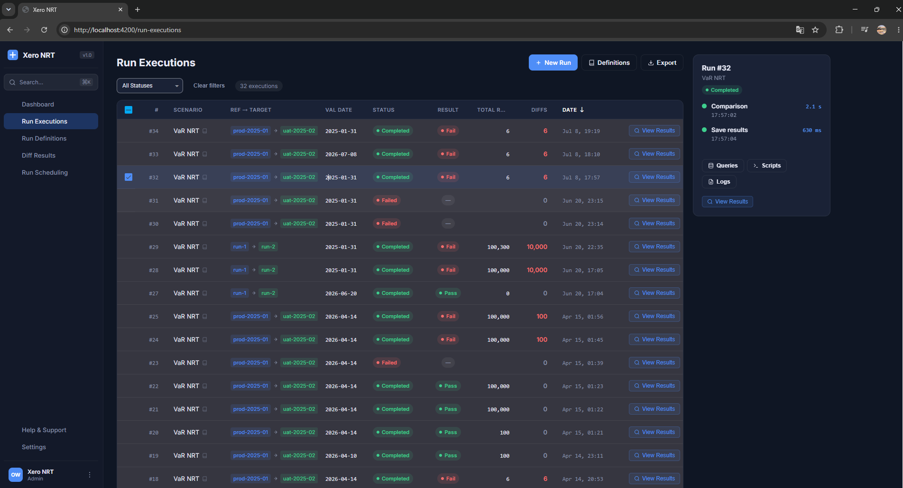

# Xero

An NRT (reference-vs-target) data comparison and orchestration platform. Reference and target datasets are acquired from a database, diffed row-by-row and column-by-column, and the results are saved and surfaced through a web UI — with run definitions, scheduled executions, and history all tracked in Postgres.



### Schema-agnostic by design

The comparison engine has **zero hard-coded knowledge of the data it compares**. There is no fixed "row" model, no domain entity, no compile-time contract tied to any business dataset:

- Each run declares its own column schema (`ColumnDef[]`: name + type — `string`, `decimal`, `int`, `long`, `bool`, `double`).
- `DynamicTypeBuilder` (`Xero.SmartComparer`) emits a real CLR type for that schema **at runtime**, via `System.Reflection.Emit` — a genuine class with typed get/set properties, not a dictionary or `dynamic` wrapper. Identical schemas are fingerprinted and cached, so the same shape is only emitted once per process.
- That generated type flows straight through Dapper's `QueryAsync<T>` for loading and through the LINQ-expression-based `ListComparer` for diffing — both bind to it exactly as they would to a hand-written POCO.
- Data acquisition is equally decoupled: `IDataLoader<T>` and `IDbConnectionFactory` abstract over the SQL dialect (Postgres or SQL Server today), so the same pipeline can point at any source table or query without touching engine code.

The practical effect: pointing the system at a brand-new dataset — a different table, a different set of columns, a different business domain entirely — is a configuration change (schema + query), never a code change or redeploy. The engine that was built to diff VaR risk runs works identically on any other tabular reference-vs-target comparison.

### Other strengths

- **Full orchestration, not just a diff library** — run definitions, ad-hoc runs, and Quartz.NET-scheduled recurring runs are all first-class, with every execution's status, timing, and result counts persisted and browsable in the UI.
- **Multiple output formats** — `Xero.ResultSaver` writes results to Excel, JSON, a queryable SQL diff-results table, and a full audit trail, so results can be consumed by a human, a script, or another system.
- **Composable pipeline** — acquisition, comparison, persistence, and presentation are separate projects (`Xero.DataAcquisition`, `Xero.SmartComparer`, `Xero.ResultSaver`, `Xero.ResultViewer`) behind narrow interfaces, and can be swapped or extended independently.
- **Two entry points** — drive it through the full web API + Angular UI for day-to-day operational use, or run a single comparison headlessly via `Xero.NrtRunner` for CI/scripted use cases.
- **Extensible run steps** — `PowerShellScriptRunner` lets a run definition invoke external scripts as part of its pipeline, without engine changes.

## Architecture

**Backend — `Xero.WebApi`** (ASP.NET Core)
Orchestration hub for the whole pipeline. Exposes REST endpoints for run definitions, run executions, schedules, and diff results; runs comparisons via `NrtPipelineRunner`; schedules recurring runs with Quartz.NET; logs to Postgres (`nrt_run_logs`) and file via Serilog.

- `Controllers/` — `NrtController`, `NrtRunsController`, `RunDefinitionsController`, `RunExecutionsController`, `RunSchedulesController`, `DiffResultsController`
- `Services/` — `NrtService` / `NrtPipelineRunner` (executes the compare pipeline), `NrtRunDefinitionService`, `NrtResultService`, `PowerShellScriptRunner` (invokes external scripts as part of a run)

**Frontend — `Xero.WebApp`** (Angular 17, DevExtreme)
CRUD/monitoring UI for defining, scheduling, running, and reviewing comparison jobs: dashboard, run definitions (+ form), run executions, run scheduling, diff results.

**Comparison engine & pipeline projects**

| Project | Responsibility |
|---|---|
| `Xero.SmartComparer` | Core generic list-diff engine (`ListComparer`, `EqualityComparer`, `HashSetComparer`, `DynamicTypeBuilder`, `CompareResult`) |
| `Xero.DataAcquisition` | Loads reference/target rows from Postgres or SQL Server (`IDataLoader`, `IDbConnectionFactory`) |
| `Xero.ResultSaver` | Persists comparison output — Excel, JSON, SQL audit, and diff-table (`NrtDiffResults`) writers |
| `Xero.ResultViewer` | Renders results after a run (console / HTML) |
| `Xero.NrtRunner` | Standalone console app that runs a single comparison end-to-end outside the API, driven by `appsettings.json` |
| `Xero.Logging` | Shared Serilog setup (`SerilogHelper`) used by every entry point |

**`Xero.JavaWebApi`** — an experimental Spring Boot (Java 21) port of `Xero.WebApi`, mirroring its controller/service/model structure. Not part of `Xero.sln`; not wired into the standard dev workflow below.

**`db/`** — Postgres schema and migrations: `create_tables.sql` (base tables), `V2`–`V4` (run executions/definitions, diff-result cleanup, run schedules), `seed_data.sql`.

## Getting started

Prerequisites: Docker, .NET 8 SDK, Node.js/npm.

```powershell
.\start.ps1   # Windows
```
```bash
./start.sh    # macOS/Linux
```

This brings up Postgres via `docker-compose.yml` (port 5433, healthcheck-gated), builds and runs `Xero.WebApi` on `http://localhost:60513` (Swagger at root), and starts the Angular dev server on `http://localhost:4200`.

To run a single comparison without the API, configure `Xero.NrtRunner/appsettings.json` and run:

```bash
dotnet run --project Xero.NrtRunner
```
